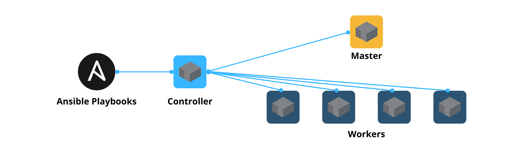

+++ 
draft = false
date = 2023-09-23
title = "Quickly Configure Kubernetes Using Ansible"
description = ""
slug = ""
authors = ["Mukkund"]
tags = ["ansible","provisioning","infrastructure","cicd"]
categories = []
externalLink = ""
series = []
+++
### _Learn how to automate cluster provisioning using Ansible_


## What is Ansible?
Ansible is an infrastructure automation tool that allows you to do the following: 
- Create consistent environments for VMs or servers.
- Provision servers in a stateless manner.
- Enable version control in infrastructure management.

Ansible makes for a great tool to automate manual and error-prone jobs. One such example is creating and configuring a Kubernetes cluster. 

While configuring a Kubernetes cluster, one has to repeat the process over several nodes which when done manually might lead to inconsistencies. Hence, in this guide, I use Ansible to install and deploy Rancher K3S on my Rasberry Pi cluster.

## What will we be doing in this guide?


- Prepare your server or VM to be managed by Ansible.
- Install required packages.
- Install K3S from Rancher.
- Configure the master and worker nodes in your cluster.

_Note: This guide assumes that you are familiar with the basic concepts of Ansible. If not, then here is a quick refresher._

### Pre-requisite steps
For the controller to access the nodes, we need to enable passwordless, SSH access to them. Therefore, go ahead and add your SSHs keys in the authorized_keys file of the rootuser in your remote host.
 
### Prepare your inventory
The inventory file contains the list of hosts you wish to manage via the worker.

```ini
[master]
micro-host-1 ansible-host=xxx.xxx.xxx.xxx

[workers]
micro-host-2 ansible-host=xxx.xxx.xxx.xxx

[microcluster:children]
master
workers

[microcluster:vars]
ansible_user=root


[nodes:children]
master
workers

[nodes:vars]
ansible_user=worker
```

In my inventory file, I have 2 hosts that I divide into master and worker groups. I have 2 parent groups called `microcluster` and `nodes` for which I use different users. The reason will be apparent in the next step.

### Create and configure users
It is recommended to create a user with `sudo` rights when provisioning your node. Therefore, we run the first set of tasks using the `root` user (or using the `microcluster` group of hosts defined in the inventory file).

```yml
---
- name: Make sure the group is enabled
  group:
    name: "{{ user_group }}"
    state: present

- name: Allow group to have passwordless sudo
  lineinfile:
    dest: /etc/sudoers
    state: present
    regexp: "^%{{ user_group }}"
    line: "%{{ user_group }} ALL=(ALL) NOPASSWD: ALL"
    validate: "visudo -cf %s"

- name: Add sudoers users to "{{ user_group }}" group
  user:
    name: "{{ user_name }}"
    groups: "{{ user_group }}"
    append: yes
    state: present
    createhome: yes
    shell: /bin/bash

- name: Set up authorized keys for the user
  authorized_key: user="{{ user_name }}" key="{{item}}"
  with_file:
    - ~/.ssh/id_rsa.pub
```

The tasks are described as follows:
- Create a group to which the desired user belongs. In my case, I call it cluster.
- Provide the group with passwordless sudo access.
- Create and add users to the newly-formed group.
- Copy the SSH keys of the controller into the remote machine.

### Install updates and required packages
The following tasks are self-evident; the packages are updated and new ones are installed. The difference is that these steps are now run using the newly-created user instead of using the root user (see the node group in the inventory file).

```yml
---
- name: Install updates
  apt:
    update_cache: yes

# Installing standard apps
- name: Installing standard development toolchain
  tags: dev-tools
  apt:
    name: "{{item}}"
    state: present
    update_cache: yes
  loop:
    - npm
    - vim
```

### Installing K3S on the master
We need to follow a slightly different procedure when installing K3S on the master and the worker nodes. Let’s first install it on the master node.

```yml

---
- name: Install K3s on the master node
  become: true
  shell: "curl -sfL https://get.k3s.io | K3S_KUBECONFIG_MODE='644' sh -s"
  when: inventory_hostname in groups['master']
  tags: k3s-master

- name: Verifying the installation of k3s on workers
  include_tasks: verify_k3s.yml
  when: inventory_hostname in groups['master']
  tags: k3s-master
```

## Configuring workers
```yml
---
- name: Fetching the master node token
  become: true
  ansible.builtin.fetch:
    src: "{{ NODE_TOKEN_DIR }}"
    dest: "{{ TMP_NODE_TOKEN_DIR }}/{{ NODE_TOKEN_FILENAME }}"
    flat: yes
  when: inventory_hostname in groups['master']
  tags: k3s-workers

- name: Ensures tmp dir exists dir exists
  file: 
    path: "{{ TMP_NODE_TOKEN_DIR }}"
    state: directory
  when: inventory_hostname in groups['workers']
  tags: k3s-workers

- name: Copy the node token file to workers
  ansible.builtin.copy:
    src: "{{ TMP_NODE_TOKEN_DIR }}/{{ NODE_TOKEN_FILENAME }}"
    dest: "{{ TMP_NODE_TOKEN_DIR }}/{{ NODE_TOKEN_FILENAME }}"
  when: inventory_hostname in groups['workers']
  tags: k3s-workers

- name: Installing and configuring K3S in worker nodes
  shell: "curl -sfL https://get.k3s.io | K3S_TOKEN={{ lookup('ansible.builtin.file', '{{ TMP_NODE_TOKEN_DIR }}/{{ NODE_TOKEN_FILENAME }}') }} K3S_URL='https://{{ ansible_default_ipv4.address }}:6443' K3S_NODE_NAME='{{ inventory_hostname }}' sh -"
  when: inventory_hostname in groups['workers']
  tags: k3s-workers

- name: Verifying the installation of k3s on workers
  include_tasks: verify_k3s.yml
  when: inventory_hostname in groups['workers']
  tags: k3s-workers
```
- Before we install K3S on the worker nodes, we need to fetch the installation token from the master.
- The first 2 steps involve copying the token from the master to the controller.
- In the 3rd step, we copy the token from the controller to the worker nodes.
- We then use the token to install and configure K3S on the hosts in the worker group.

### Verifying installation of K3s
The following tasks are carried out to verify if K3S has been properly installed on all of the managed nodes.

```yml
---
- name: Getting installation directory of {{K3S_BINARY}} 
  shell: "which {{K3S_BINARY}}"
  register: kubeout
  failed_when: "kubeout.stdout == ''"
  tags: 
    - k3s-master
    - k3s-workers

- name: "{{K3S_BINARY}} installation status"
  ansible.builtin.debug:
    msg: "Kubectl installed in {{ kubeout.stdout }}"
  tags:
      - k3s-master
      - k3s-workers
```

### And….voilà!
And just like that, you have configured Kubernetes for your cluster by running just two Ansible playbooks.

<br>

## Want to Connect?

Thank you for reading my article. You can also find me on [LinkedIn](https://www.linkedin.com/in/mukkundsunjii/) and my work on [GitHub](https://github.com/mukkund1996).