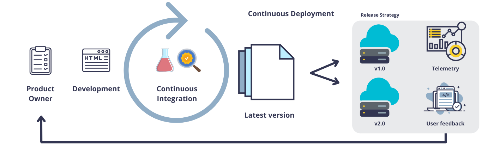
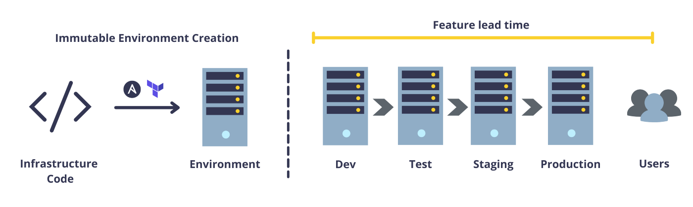
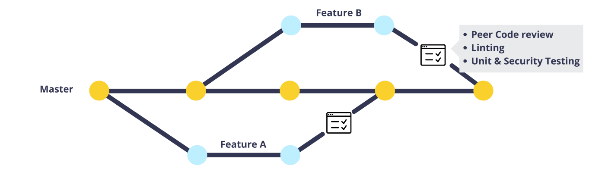
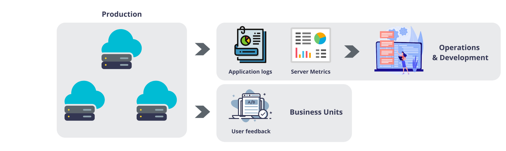

+++ 
draft = false
date = 2022-04-17
title = "Use DevOps Techniques to Improve Productivity"
description = "These methodologies help eliminate grunt work and increase your team’s throughput."
slug = ""
authors = []
tags = []
categories = ["devops","productivity"]
externalLink = ""
series = []
+++
### _These methodologies help eliminate grunt work and increase your team’s throughput._

# Why DevOps?

It aims to automate as many tasks as possible, reducing toil in the development and operations of complex systems.
It promotes a safe and secure system to work and develop.
As an intersectional discipline that utilizes the talents of multiple departments, it can greatly promote organizational learning and coordination throughout the company.

## Technology Value Stream

The development of a software product is the result of a technology value stream. The technology value stream starts from the business units, goes through various technical teams and ends up with the customer. Much like an assembly line in a car manufacturing plan whereas here, the final product is an intangible entity.

## Where does DevOps come into play?
A portion of the value stream that concerns technology teams is shown in the figure above. DevOps principles help streamline the value stream allowing us to deliver value to the customer as fast as possible. Thus it allows us to:

- Identify bottlenecks
- Improve feedback for upstream units
- Automate, automate, automate…

# What can you do about it?
Being part of the value stream, there are multiple tools and methodologies that you can adapt to enable a fast flow across the value stream.

## Create. Environments. On-Demand.

Without fast, scripted, immutable environment creation, you might run into the age-old saying — “Hey, but it works on my laptop!”. It is also the precursor for CI/CD processes which provides feedback for developers and eases deployment.

You can use different configuration management tools such as Ansible, Chef, and Terraform to create environments on-demand. By integrating it with version control systems (VCS) such as GIT, we can efficiently track and test changes. In conclusion, you should treat infrastructure configuration as you would treat the source code of your software.

## Enable Continuous Integration (CI)

 

- Merge small and merge a lot.
- Encourage a testing culture amongst developers.
- Create good peer code review processes when merging changes.
- Allow for automated unit, integration and security testing policies.

All of the above practices enable developers to get quick feedback for their work and reduce the risk of letting bugs slip into production.

## Enable Continuous Delivery and Deployment

In Continuous Delivery, changes are continuously integrated into the main branch. Whereas, Continuous Deployment takes it one step further by enabling automated deployment into production.
Releasing small batches leads to less deployment anxiety and lower lead times. It nurtures a culture of testing and experimentation.
Modern DevOps services such as Gitlab CICD, Github Actions, and Azure DevOps can be used to implement CI/CD.

## Improve Production Telemetry

- Releasing new features is only part of the product development process. Another crucial step is to monitor production environments and services provided to the customer.
- Telemetry allows for the collection of usage and engagement metrics. These help us judge the performance of the new features.
- Telemetry describing the health of the application allows operations to quickly discover and diagnose problems.

# Resources

This article was based on ideas described in the book “The DevOps Handbook” by Gene Kim, Patrick Debois, Jez Humble and John Willis.

 

## Want to Connect?

Thank you for reading my article. You can also find me on [LinkedIn](https://www.linkedin.com/in/mukkundsunjii/) and my work on [GitHub](https://github.com/mukkund1996).
