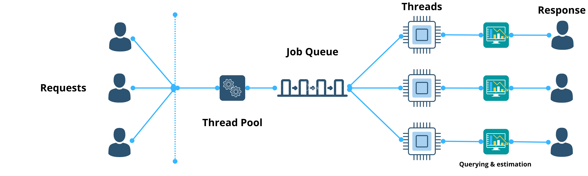
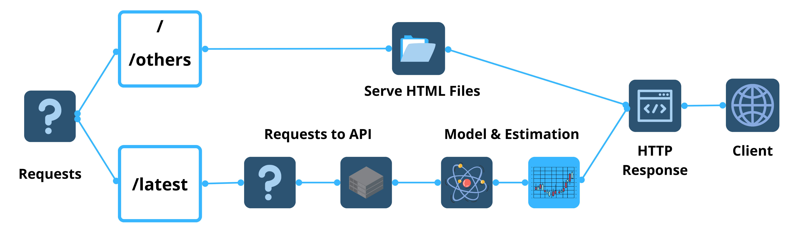
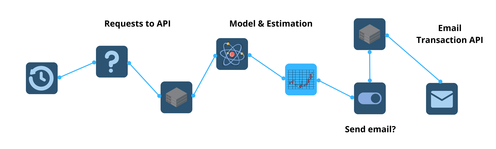

+++ 
draft = false
date = 2023-01-02
title = "Building a Forex Estimator in Rust"
description = "A zero-to-minimal dependency web server built from scratch in Rust"
slug = ""
authors = []
tags = []
categories = ["rust","data-science","network","webserver"]
externalLink = ""
series = []
+++
### A zero-to-minimal dependency web server built from scratch in Rust


With the current ecosystem of powerful frameworks, it is easy to forget the amount of complexity abstracted away from the developers. The bright side is that such frameworks provide a softer learning curve for newer developers and low lead times to create prototypes.

### Not Reinventing the Wheel
For instance, 9 lines of code are all you need to get a REST API web server up and running using express on Node JS.

```js
const express = require('express')
const app = express()
const port = 3000

app.get('/', (req, res) => {
  res.send('Hello World!')
})

app.listen(port, () => {
  console.log(`Example app listening on port ${port}`)
})
```

Let's take another example, you can set up a linear regression model with just 4 lines of code excluding the data importing and cleaning steps.

```py
# Import the packages and classes needed in this example:
import numpy as np
from sklearn.linear_model import LinearRegression

x = np.array([5, 18, 26, 37, 48, 52]).reshape((-1, 1))
y = np.array([8, 23, 15, 12, 22, 36])

# Creating the model
model = LinearRegression().fit(x, y) 

# Predicting the dependent variable using the training data
y_pred = model.predict(x)
print(f"Prediction: {y_pred}")
```

### Reinventing the Wheel
I wanted to create a web server that could fetch the latest foreign exchange rates between two currencies and give me a simple estimate for the future. I could have achieved this easily using a python application based on Flask. However, in the alternate universe where we did not have access to these frameworks, how can we achieve this?

## Web Server Overview
Since the objective is to get our hands down and dirty, I chose Rust to build the web application. Rust is a very low-level language that allows developers to build concurrent, and highly performant applications safely. To have a high throughput, the web server needs to concurrently process requests and provide estimations back to the client. The web server is built on top of the one explained in the final project of the Rust book.



### Handling Requests
The server is logically divided into several components. The main thread of the web server would listen to a prescribed port. As the requests pour in, it then assigns each of the requests to the thread pool. These requests then get added to the job queue. Worker threads participating in the thread pool pick the jobs from the queue one by one. Due to the elegance of Rust, all of the mentioned functionalities can be built using just the standard library.

**Dependencies: None**



### Querying External APIs 
To build our Forex linear regression model, we need historical data. Therefore, the web server needs to query external APIs to obtain this information. Shout out to ExchangeRate for providing this service for free. 
So how do we make requests? Earlier when I said low-level, I meant very low-level. This means that our application needs to be able to: 
- Establish TCP handshakes with the host.
- Generate an HTTP request.
- Parse the HTTP response back from the server and handle failures.
- Deserialize the data from the body of the response.

All of the above steps need to be achieved to feed the linear regression model the appropriate training data.

**Dependencies: Serde**

### Linear Regression Model
Building regression models require knowledge of statistics, linear algebra, optimization, and manipulation of data structures. Using the wonderful article published by Kumud Lakara, I was able to replicate the gradient descent method in Rust. 
Due to the current state of linear algebra crates in Rust, matrix multiplications and dot products in the library are free from any dependencies. The caveat is that much of what I have implemented is strictly through vectors in Rust. A more performant alternative would be to use data structures with pre-defined capacities. The implementation can be found in the model.rs file.
Dependencies: None

## Emailer Binary


As a convenience feature, I also added a separate binary that would run as a cronjob at set intervals. The binary would use the library to query the latest rates from the exchange API and check if it passes a certain threshold. If it does, it proceeds to estimate the future rates and send an email through an external API.
To contrast how much easier it would be to build and send HTTP requests using external HTTP clients, I used the reqwests library in Rust. Previously, the routine that took almost 50 lines (connecting to the host, creating HTTP requests and parsing the response) now can be achieved in a mere 8 lines.

```rs
let response = client
            .post(SENDGRID_API_URI)
            .header(AUTHORIZATION, format!("Bearer {api_key}"))
            .header(CONTENT_TYPE, "application/json")
            .header(ACCEPT, "application/json")
            .body(body)
            .send()
            .unwrap();
```
#### The only catch is that we now have a dependency 😉

## Conclusion
Never do this in a production environment. Avoid reinventing the wheel! 
### But…
- This exercise did teach me the very fundamentals of regression models, data structures, concurrent processing, and networking. 
- It has taught me the pitfalls of blindly trusting external libraries without understanding the domain on which it was built on top of.
- Most importantly, it made me appreciate all of the wonderful tools that are available at our disposal.

<br>

## Want to Connect?

Thank you for reading my article. You can also find me on [LinkedIn](https://www.linkedin.com/in/mukkundsunjii/) and my work on [GitHub](https://github.com/mukkund1996).