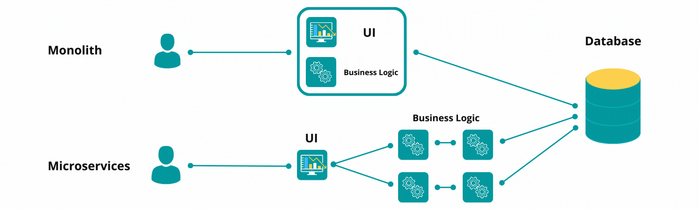
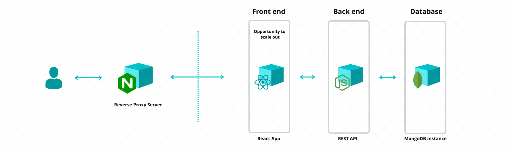
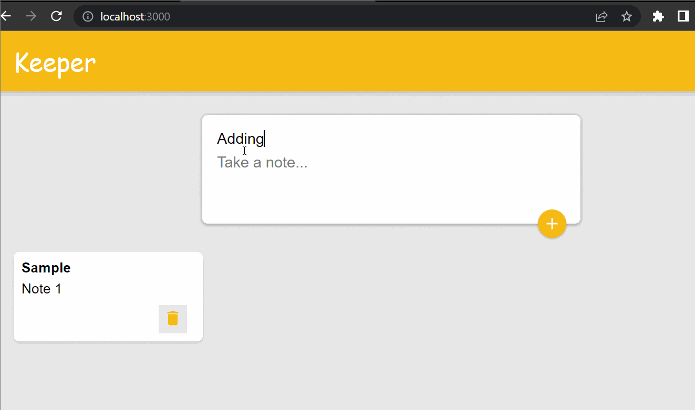
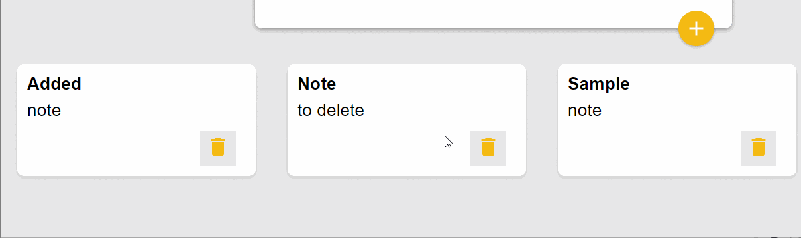
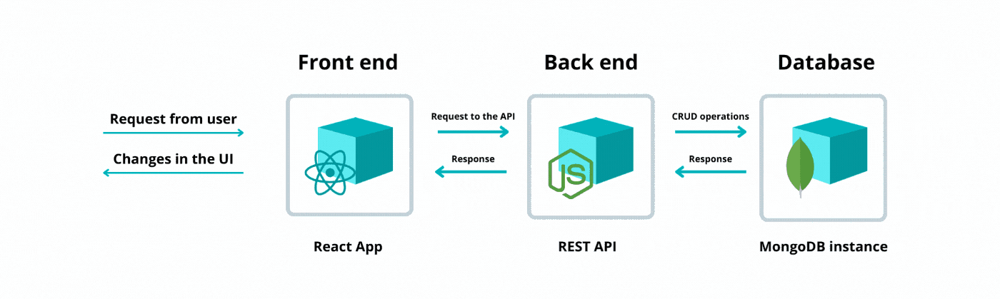

+++ 
draft = false
date = 2022-04-07
title = "Microservice Architecture"
description = ""
slug = ""
authors = []
tags = ["microservices","architecture"]
categories = []
externalLink = ""
series = []
+++
# Microservice Architecture — Through Visuals
### _Learn about the microservice architecture through infographics and a simple app._

If you are part of the technology industry or working with technology teams, then you might have heard the term microservices. So what is it and why do you need to know it?

### What is microservice architecture?
It is an architectural pattern that divides a complex software system into smaller services. As opposed to monolithic architecture, which contains several tightly coupled parts that carry out the business logic.

### Why is it important for you to know?
Product owner: By having the over-arching system design in mind, you will be able to identify bottlenecks in the value stream and manage teams.
Software Developers: You will understand how the data flows in and out of the system. This will improve the overall quality of the software you make.
QA: Able to identify and build a prognosis of the problems in the program.

### Microservices in action

The architectural pattern can be simplified further with an example. I have built a simple notetaking application (a humorous copy of Google Keep, but it works as a simple example).

### App Functionality
The following GIFs showcase the functionality of the app:

### App Workflow

The application is based on the MERN stack (Mongo-Express-React-Node frameworks). The workflow is as follows:

The react app gets served to the user by a reverse proxy server like NGINX.
The front end app sends requests to a REST API based on the user interaction.
The web server on the back end responds to the requests by creating, reading, updating or deleting data (CRUD operations) on the database.
As seen above, the microservices communicate with each other over HTTP. When designed well enough, each service can be:

Independently developable, maintainable, testable, deployable and scalable.
Able to be supported by a small team.
Loosely coupled.
Of course, microservice architecture comes with its caveats and is not ideal in all scenarios. Nevertheless, it is a proven design model when creating complex software systems.

### Footnotes
The React notetaking app was built using the course by 
Angela Yu
. It was further modified to allow for the data to be persisted.
This article is not meant to be a technical guide. Please refer to the links provided for detailed information.

 

## Want to Connect?

Thank you for reading my article. You can also find me on [LinkedIn](https://www.linkedin.com/in/mukkundsunjii/) and my work on [GitHub](https://github.com/mukkund1996).
