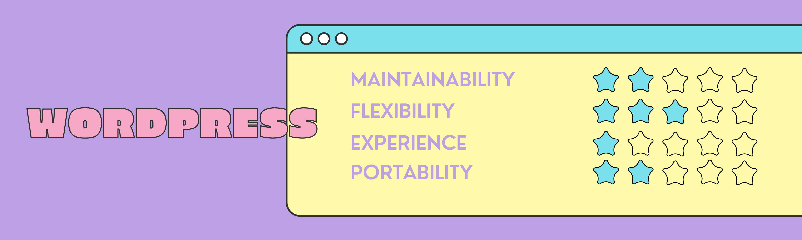
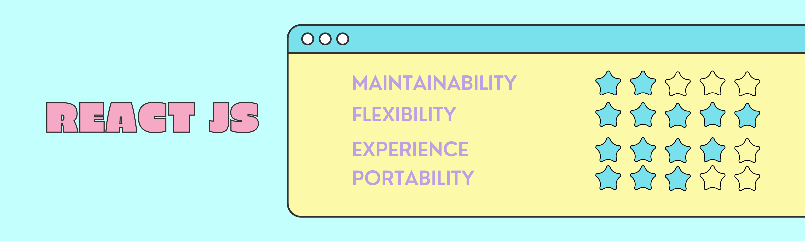
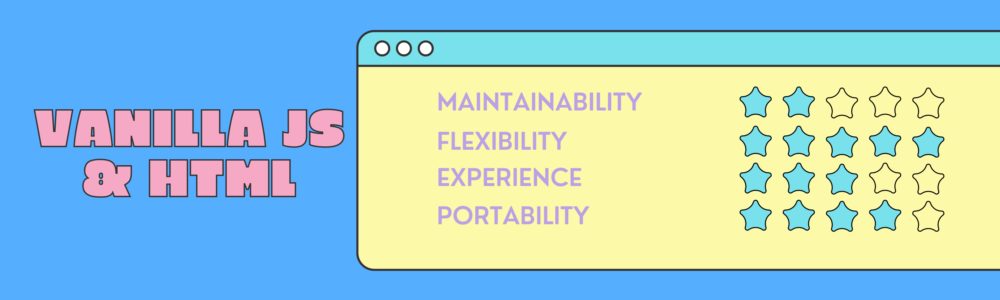

+++ 
draft = false
date = 2022-10-29
title = "Building a portfolio website as a developer"
description = "A (mostly) non-technical discussion about choosing the right tool."
slug = ""
authors = []
tags = []
categories = ["website","hugo","requirements","framwork"]
externalLink = ""
series = []
+++


A quick disclaimer: This is not a step-by-step guide to building a website. This is rather a non-technical discussion about the different options that are available to a developer. However, I do touch lightly on the framework that I chose to build my portfolio website with.

## Choice Paralysis
Web development has been at a curious cross-road for several years now. Looking at the landscape from a technical perspective, it seems that there is an endless stream of frameworks on the horizon. This could mean both good and bad. The positive side is the power of choice - the ability to choose the best technology available to create our web apps. 

On the other hand, the number of options available to a developer often leads to choice paralysis. The average quality of the learning resources becomes less reliable and visible - leading to lower-quality code from independent developers. 

For instance, when learning NodeJS, I was surprised that there wasn't a straightforward way of making a [GET/PUT request](https://stackoverflow.com/questions/9577611/http-get-request-in-node-js-express). It led me to google around for several more rounds and I ended up not using what was recommended in the NodeJS [documentation](https://nodejs.org/api/http.html).

## Problem at Hand
I wanted to create a portfolio website to showcase my projects and publish my articles. To be frank, in the past, I have fallen into the trap of shaping the problem statement around the framework of choice. However, we can all agree that it should be the other way around. For my project, the requirements are the following: 
- Easy to publish articles.
- Easily maintainable.
- Can be easily hosted - preferably for free 🤓
- Time investment should not be more than 2 weeks. 
- Must be customizable - using `CSS` or `SCSS`

## Check your Priorities
With the requirements now set, I can now choose the framework that serves them best, right? Not quite, first I need to reflect on what the ideal "framework" would have to offer. Based on the needs, the quality of the framework is judged based on the following parameters in order of reducing importance:

### 1. Maintainability
- The code base needs to be easily maintainable. I plan on posting articles regularly and using my website as a point of entry to my blogs.
- The ability to easily update and then edit the content of my website is a must-have. 

### 2. Flexibility
- As a developer, I should be able to add my touch to my website.Stylizing my website without reading through days of documentation would be appreciated.
- This is something a lot of no/low-code alternatives, including WordPress fail to sufficiently provide. 

### 3. Experience
- In my opinion, the learning curve of a framework could make or break its appeal. 
- Quickly getting the development server up and running would be a huge help in reducing the time invested in the project.

### 4. Portability
- Having deployed on Heroku and Vercel in the past, there is a sense of peace of mind offered by a fully managed CI/CD pipeline. 
- Ideally, the deployment of the website should be free and served through a PaaS. 

## The Hunt for the Stack
We now have the requirements and the judgement criteria. Using both, I found some potential candidates:

### WordPress


### React


### Hugo


### Vanilla JS


## The winner is...Hugo
### Why you ask?
It scores well in almost all of the criteria: 
- **Markdown**: Hugo uses markdown files to generate webpages. Markdown would make it very easy for me to create and update articles in my blog. (as I am doing right now)

- **CSS**: It might look inflexible at first when it comes to styling, but there are a few workarounds to add your custom CSS to the website.
- **Speed**: It is extremely fast! Written mostly using GO, the build times are some of the fastest that I have seen.
- **Simple**: This is the first time I have heard about Hugo and it is extremely well-designed and to the point. Don't believe me? The following lines are all you need to get started: 

```
# Install Hugo
brew install hugo

# Create a website
hugo new site BrandNewSite

# Add content
hugo new posts/my-first-post.md

# Run the development server
hugo server -D

# Build for production
hugo -D
```
### Deployment
I simply used one of the pre-configured GitHub actions to deploy it on GitHub pages. The solution offers everything that I'd hoped for.

✅ Fully managed

✅ Builds the static files every time I push to master

✅ Completely free

## Conclusion
To reiterate, this article is not written to promote a new framework that I came across online. But it is written to emphasize the importance of looking at the problem statement before choosing a flashy new technology to solve it with. In the end, the flashy new technology might not serve the requirements well and you coulkd end up producing a sub-par product.

This project is a reminder for me to be language/framework/technology agnostic. So say it together with me: 

### The requirements shape the technology, and never the other way around.

## Want to Connect?

Thank you for reading my article. You can also find me on [LinkedIn](https://www.linkedin.com/in/mukkundsunjii/) and my work on [GitHub](https://github.com/mukkund1996/mukkund1996.github.io).