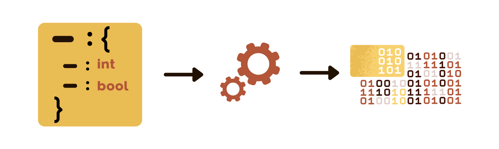
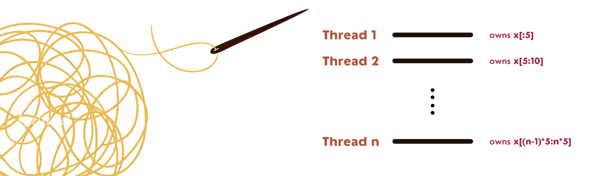

+++ 
draft = false
date = 2022-08-08
title = "Over-engineering an Application in Rust"
description = ""
slug = ""
authors = []
tags = ["rust","cli","multi-threading"]
categories = []
externalLink = ""
series = []
+++
### _Here’s what I learned and why you should do it too._

I recently set out to automate a task at my job that required a lot of boilerplate code and manual formatting. My line of solution would be to ingest a JSON file containing the parameters and attributes needed to generate the resulting text file.

Seems simple enough, right? A simple python script or a notebook would probably be the easiest way to achieve the outcome. But I took a different approach. Instead, I created a multi-threaded command line tool written in (wait for it)… rust. A language that I have no experience in. What did I learn from this exercise and why do I think you should try out something similar?

## 🤖 Rust is beautiful but rough

I write Python and JavaScript for a living. They are known for being simple, high-level, portable and very dynamic. Having also learnt and practised C++ during school, I was starting to miss some of the “rigorous” nature of statically compiled languages.

So, I decided to take up learning Rust and ride the hype for this new language. Some of the reasons that I chose to learn Rust over GO or other counterparts were:

##### 💨 Statically compiled, therefore extremely fast and designed for performance.

##### 🖥 It is a low-level, system programming language. Therefore, it forces you to get accustomed to thinking about data structures, memory and application architecture before building anything.

##### ✅ Range of applications that can be built with the language — from games, and web servers to bootstrapping web apps using web assembly (WASM).

Great, all of this sounds good. Except there was a problem. Rust is infamous for having a steep learning curve. After a course and a book and multiple hours of reading rust documentation, I still manage to get hassled by the compiler. But all in all, Rust is a very elegantly designed language and is very intuitive once you get the hang of it.

## 🏃🏽Test Driven Development (TDD)
TDD is a concept that I struggle with. On one hand, when it works, it allows for rapid iterations for solution design. On the other hand, it also becomes very cumbersome when the problem statement changes too quickly. This would mean that the test cases also change leading to double the amount of work.

In this project, I adopted a hybrid approach which appeared to work very well. For the functions which had concrete outcomes, I developed the tests first. Meanwhile, for other, more volatile functions, the tests came later.

The idiomatic way of writing unit tests in rust is to place them in the same file as the source code. This was quite refreshing and promoted TDD because of less context switching and more accessibility.

## 🧵 Concurrency

Now I know what you are thinking, why would you ever need multiple threads to process a simple JSON file and write it into a text file using some logic? But hear me out.

Coming from a non-computer science background, concurrency always seemed to be the pinnacle of programming for me. It also provided the opportunity to revisit and learn about thread management, message passing, memory sharing etc.

But in the background, I also hear the faint noises of programmers yelling at segmentation faults, memory leaks and race conditions. In any case, I decided to learn what rust advertises as “fearless concurrency“. In the process, here are the challenges that I encountered while parallelizing my application:

⁉️ What part of the application do I parallelize? Should the main thread be responsible for reading and writing the string object?

⁉️ How do I split my data after reading it from the JSON file?

⁉️ How do I treat the deserialised input data? Do I share it among different threads using mutex or do I decompose it and treat it as immutable?

These questions allowed me to rethink how the program is structured and it shined the importance of immutability of data. In the end, the route that I chose was to let the main thread do the reading and writing. The read data was then deserialised into a vector of struct objects and distributed across each thread. As each thread finishes processing the object, it returns a string and then sends them through to the main thread. Once receiving all of the data, the main thread finally aggregates the string and writes it into a file.

Simple… no?

## Why you should perform a similar exercise?

So you might again ask, why would I conceive such a complicated solution to a relatively easy problem? Well let’s put it this way, through this exercise, I was able to achieve the following as a side effect:

##### ✅ Got a bit more comfortable with writing idiomatic code in rust.

##### ✅ Read code written by other, more experienced developers while searching for solutions to a problem.

##### ✅ Experimented with multi-threading and message passing.

Sometimes its good to take the harder path to solve a solution 😉

 

## Want to Connect?

Thank you for reading my article. You can also find me on [LinkedIn](https://www.linkedin.com/in/mukkundsunjii/) and my work on [GitHub](https://github.com/mukkund1996).