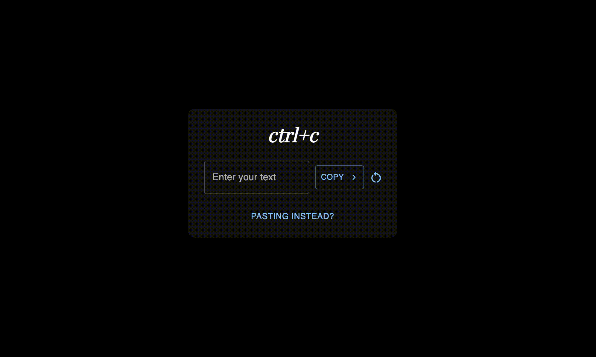

+++
title = "Projects"
slug = "projects"
+++
 

# 1. Unmasking Hate: An Integrated Approach to Detecting Hate Speech in Social Media
###### (Jul 2023 - Present)

Final Year project
- Proposing a novel approach to detect hate speech in online content (tweets)
- Uses dual contrastive learning, emotion-based and author profiling based techniques along with transfer leaning approaches to enhance the model performance
- Deliverables: ‘hate-hunter’ Python Package Index (PyPI), ‘hate-hunter-rest’ a RESTful API that do the detection of hate speech 

## Tech Stack
  

<!-- #### [Demo](https://always-composed.vercel.app/) -->
#### [Code](https://github.com/pasan-SK/AiLERT-FYP)

---

# 2. Migrate existing “Updates delivery subsystem to Azure” 
###### (Feb 2023 - Jun 2023)
<!--  -->
Carried out while I was on the internship at WSO2 as an individual project.
Tasks:
- Research about multiple architectural solutions to implement the migration with several Azure services (Azure API management, Azure CDN, Azure Blob storage etc.)
- Demonstrate the possible solutions’ pros and cons to team leads and get approval for the most preferred approach.
- Use Azure SDK for Java/Python to change existing codebases to support the migration.
- Develop scripts to migrate currently deployed artifacts (on Nexus and SVN repositories) to Azure blob storage.

## Tech Stack
  

---

# 3. Workflow Management System for Galle District Irrigation Department
###### (Aug 2022 - Nov 2022)

<!--  -->

The semester 5 project of my undergraduate studies is a proof of concept for the Galle district Irrigation department. This is my first experience working with a real client. The system is developed to be used as an alternative for some highly paper-based tasks happening in the Galle district irrigation department currently. 

The DI (Director of Irrigation) user of the system can create a workflow with ordered subtasks and assign employees in the system to each subtask. Then the employees can carry out the work specified in the subtask and complete it. Assigned users and DI can view the current progress and each subtask completion, deletion, and other special events will be notified to the relevant users. 

## Tech Stack
   

#### [Code](https://github.com/KabilanMA/workflow-management-system-frontend)

---

# 4. Content Management System
<!--  -->
###### (Jan 2020 - Aug 2020)

This Content Management System was done as an individual project before commencing my studies in the Computer Science and & Engineering department. I wanted to be familiarized with some web development technologies and therefore to learn and grow my skills, I thought of doing an individual project rather than following only the theory parts.

The system provides users the ability to
- upload blog posts about popular computer science courses which they have followed, under different categories.
- comment on blog posts
 
The system admins can
- approve blog posts and comments
- decline blog posts and comments,
- create/update/delete users
- create/update/delete categories so that unapproved posts and comments won’t be visible to the public.

<!-- Technologies used: PHP, HTML, CSS, and MySQL -->

## Tech Stack
    

#### [Code](https://github.com/pasan-SK/content-management-system)

---

# 5. COVIDGuide
<!--  -->
###### (Nov 2020 - Jan 2021)

COVIDGuide is an online platform for authorities to publish guidelines/circulars for the public in an interactive manner. The system was developed as the semester3 project for the module 'Object Oriented Software Development'. The authority officers can create/update covid-19 guidelines under different categories and the general public can view these guidelines, subscribe to categories (after registering to the system) to get notifications when an update to the relevant category has been made, etc.

<!-- Technologies used: PHP, HTML, CSS, JavaScript, and MySQL -->
## Tech Stack
      

#### [Code](https://github.com/pasan-SK/content-management-system)